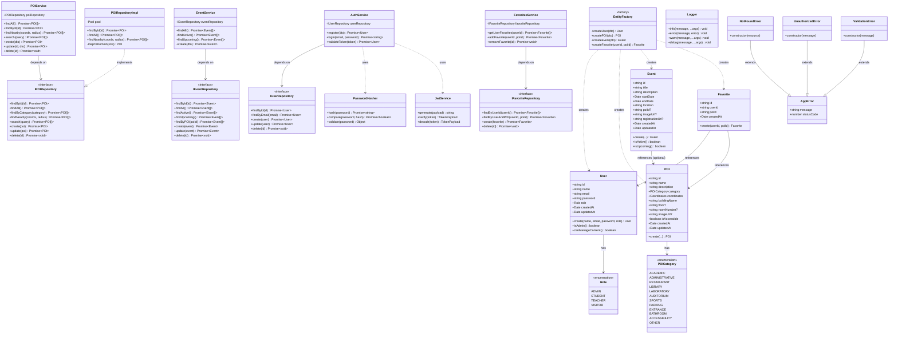

```mermaid
classDiagram
    %% Domain Layer
    class User {
        +string id
        +string name
        +string email
        +string password
        +Role role
        +Date createdAt
        +Date updatedAt
        +create(name, email, password, role) User
        +isAdmin() boolean
        +canManageContent() boolean
    }

    class POI {
        +string id
        +string name
        +string description
        +POICategory category
        +Coordinates coordinates
        +string buildingName
        +string floor?
        +string roomNumber?
        +string imageUrl?
        +boolean isAccessible
        +Date createdAt
        +Date updatedAt
        +create(...) POI
    }

    class Event {
        +string id
        +string title
        +string description
        +Date startDate
        +Date endDate
        +string location
        +string poiId?
        +string imageUrl?
        +string registrationUrl?
        +Date createdAt
        +Date updatedAt
        +create(...) Event
        +isActive() boolean
        +isUpcoming() boolean
    }

    class Favorite {
        +string id
        +string userId
        +string poiId
        +Date createdAt
        +create(userId, poiId) Favorite
    }

    class Role {
        <<enumeration>>
        ADMIN
        STUDENT
        TEACHER
        VISITOR
    }

    class POICategory {
        <<enumeration>>
        ACADEMIC
        ADMINISTRATIVE
        RESTAURANT
        LIBRARY
        LABORATORY
        AUDITORIUM
        SPORTS
        PARKING
        ENTRANCE
        BATHROOM
        ACCESSIBILITY
        OTHER
    }

    %% Factory
    class EntityFactory {
        <<factory>>
        +createUser(dto) User
        +createPOI(dto) POI
        +createEvent(dto) Event
        +createFavorite(userId, poiId) Favorite
    }

    %% Interfaces (Repositories)
    class IUserRepository {
        <<interface>>
        +findById(id) Promise~User~
        +findByEmail(email) Promise~User~
        +create(user) Promise~User~
        +update(user) Promise~User~
        +delete(id) Promise~void~
    }

    class IPOIRepository {
        <<interface>>
        +findById(id) Promise~POI~
        +findAll() Promise~POI[]~
        +findByCategory(category) Promise~POI[]~
        +findNearby(coords, radius) Promise~POI[]~
        +search(query) Promise~POI[]~
        +create(poi) Promise~POI~
        +update(poi) Promise~POI~
        +delete(id) Promise~void~
    }

    class IEventRepository {
        <<interface>>
        +findById(id) Promise~Event~
        +findAll() Promise~Event[]~
        +findActive() Promise~Event[]~
        +findUpcoming() Promise~Event[]~
        +findByPOI(poiId) Promise~Event[]~
        +create(event) Promise~Event~
        +update(event) Promise~Event~
        +delete(id) Promise~void~
    }

    class IFavoriteRepository {
        <<interface>>
        +findByUserId(userId) Promise~Favorite[]~
        +findByUserAndPOI(userId, poiId) Promise~Favorite~
        +create(favorite) Promise~Favorite~
        +delete(id) Promise~void~
    }

    %% Application Layer (Services)
    class AuthService {
        -IUserRepository userRepository
        +register(dto) Promise~User~
        +login(email, password) Promise~string~
        +validateToken(token) Promise~User~
    }

    class POIService {
        -IPOIRepository poiRepository
        +findAll() Promise~POI[]~
        +findById(id) Promise~POI~
        +findNearby(coords, radius) Promise~POI[]~
        +search(query) Promise~POI[]~
        +create(dto) Promise~POI~
        +update(id, dto) Promise~POI~
        +delete(id) Promise~void~
    }

    class EventService {
        -IEventRepository eventRepository
        +findAll() Promise~Event[]~
        +findActive() Promise~Event[]~
        +findUpcoming() Promise~Event[]~
        +create(dto) Promise~Event~
    }

    class FavoritesService {
        -IFavoriteRepository favoriteRepository
        +getUserFavorites(userId) Promise~Favorite[]~
        +addFavorite(userId, poiId) Promise~Favorite~
        +removeFavorite(id) Promise~void~
    }

    %% Infrastructure Layer
    class POIRepositoryImpl {
        -Pool pool
        +findById(id) Promise~POI~
        +findAll() Promise~POI[]~
        +findNearby(coords, radius) Promise~POI[]~
        -mapToDomain(row) POI
    }

    class PasswordHasher {
        +hash(password) Promise~string~
        +compare(password, hash) Promise~boolean~
        +validate(password) Object
    }

    class JwtService {
        +generate(payload) string
        +verify(token) TokenPayload
        +decode(token) TokenPayload
    }

    class Logger {
        +info(message, ...args) void
        +error(message, error) void
        +warn(message, ...args) void
        +debug(message, ...args) void
    }

    class AppError {
        +string message
        +number statusCode
    }

    class NotFoundError {
        +constructor(resource)
    }

    class UnauthorizedError {
        +constructor(message)
    }

    class ValidationError {
        +constructor(message)
    }

    %% Relationships
    User --> Role : has
    POI --> POICategory : has
    Favorite --> User : references
    Favorite --> POI : references
    Event --> POI : references (optional)

    EntityFactory ..> User : creates
    EntityFactory ..> POI : creates
    EntityFactory ..> Event : creates
    EntityFactory ..> Favorite : creates

    AuthService --> IUserRepository : depends on
    POIService --> IPOIRepository : depends on
    EventService --> IEventRepository : depends on
    FavoritesService --> IFavoriteRepository : depends on

    POIRepositoryImpl ..|> IPOIRepository : implements
    
    AuthService ..> PasswordHasher : uses
    AuthService ..> JwtService : uses

    NotFoundError --|> AppError : extends
    UnauthorizedError --|> AppError : extends
    ValidationError --|> AppError : extends
```