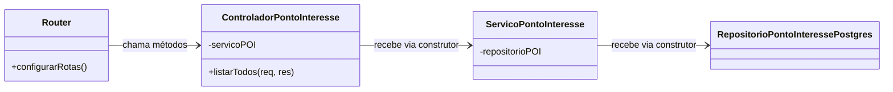

```mermaid
classDiagram
    direction LR

    class Router {
      +configurarRotas()
    }

    class RepositorioPontoInteressePostgres
    class ServicoPontoInteresse {
      -repositorioPOI
    }
    class ControladorPontoInteresse {
      -servicoPOI
      +listarTodos(req, res)
    }

    Router --> ControladorPontoInteresse : chama métodos
    ControladorPontoInteresse --> ServicoPontoInteresse : recebe via construtor
    ServicoPontoInteresse --> RepositorioPontoInteressePostgres : recebe via construtor
```