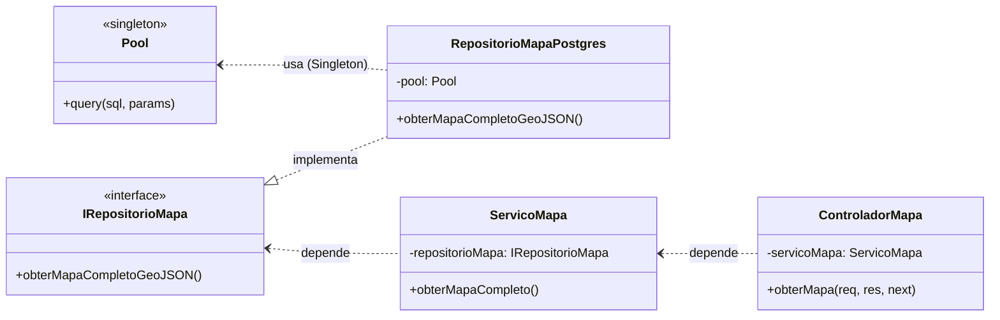

```mermaid
classDiagram
    direction LR

    class Pool {
      <<singleton>>
      +query(sql, params)
    }

    class RepositorioMapaPostgres {
      -pool: Pool
      +obterMapaCompletoGeoJSON()
    }

    class IRepositorioMapa {
      <<interface>>
      +obterMapaCompletoGeoJSON()
    }

    class ServicoMapa {
      -repositorioMapa: IRepositorioMapa
      +obterMapaCompleto()
    }

    class ControladorMapa {
      -servicoMapa: ServicoMapa
      +obterMapa(req, res, next)
    }

    Pool <.. RepositorioMapaPostgres : usa (Singleton)
    IRepositorioMapa <|.. RepositorioMapaPostgres : implementa
    IRepositorioMapa <.. ServicoMapa : depende
    ServicoMapa <.. ControladorMapa : depende
```